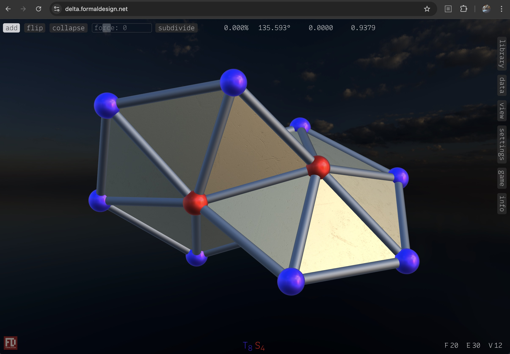

# Deltahedron

A 3D interactive application for exploring the world of deltahedra, which are polyhedra made only from equilateral triangles.

The app is online at [https://delta.formaldesign.net](https://delta.formaldesign.net).

## WebGPU

This project does not use any dependencies and was almost completely written from scratch using [WebGPU](https://www.w3.org/TR/webgpu/) for rendering and compute shaders. Many thanks to [webgpufundamentals.org](https://webgpufundamentals.org), [WebGPU samples](https://webgpu.github.io/webgpu-samples), [toji.dev](https://toji.dev), and also to [learnopengl.com](https://learnopengl.com) for great tutorials about lighting!✨
